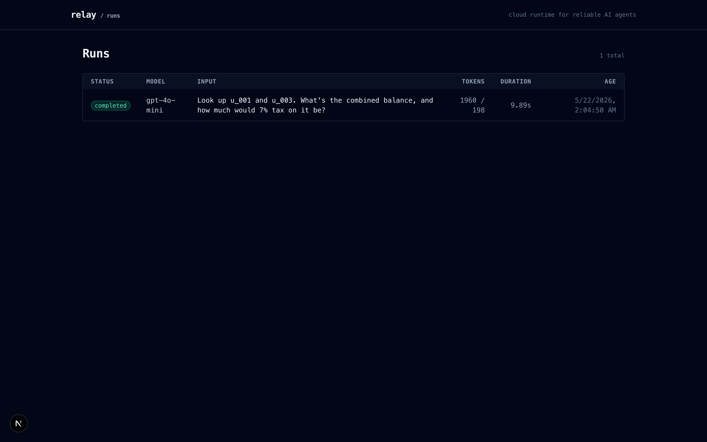
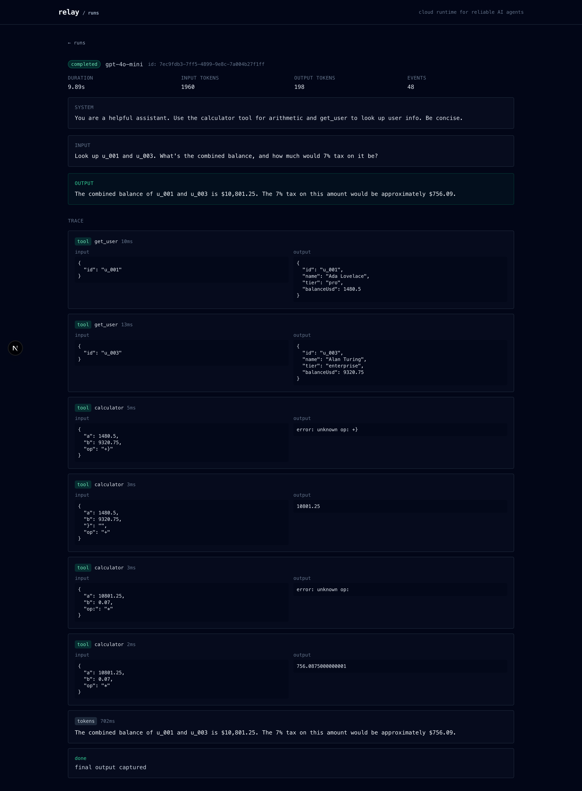

# Relay

**The backend cloud for reliable AI agents.**

Memory, tools, traces, multi-agent orchestration, voice — without
building infrastructure yourself.

[](https://github.com/KevinCorrea5103/relay/actions/workflows/ci.yml)
[](https://github.com/KevinCorrea5103/relay/actions/workflows/ci-integration.yml)
[](https://github.com/KevinCorrea5103/relay/actions/workflows/deploy.yml)
[](https://www.npmjs.com/package/@relayhq/sdk)
[](https://pypi.org/project/relayhq/)
[](LICENSE)

**SDKs:** `npm install @relayhq/sdk` · `pip install relayhq` · cURL / Go / any (HTTP+SSE)

```ts
const agent = createAgent({
  model: "claude-sonnet-4-6",
  memory: { namespace: `user:${userId}` },
  tools: [github, slack],
});

await agent.run("Review the last PR");
```

Open source under Apache 2.0. Self-host with Docker Compose, or use the
hosted version at [relaygh.dev](https://relaygh.dev).

### Every run is a complete execution trace

Tokens, tool calls, tool results, memory hits, sub-agent runs, errors —
captured in order, ready for replay. Dashboard at `localhost:3000`.





---

## What you get

**Agents you write in normal code, infrastructure you'd otherwise build yourself.**

| Capability | What it does |
|---|---|
| **Streaming agent runs** | One `createAgent({ model, tools })`, get an SSE event stream of tokens, tool calls, tool results, errors, done. |
| **Multi-provider routing** | Anthropic, OpenAI, and any OpenAI-compatible endpoint (Ollama, vLLM, LM Studio) — picked by model prefix or `provider:model`. |
| **BYOK with encryption** | Your provider keys encrypted with AES-256-GCM per tenant. Tokens flow direct to the LLM — you pay the LLM, we don't take a margin. |
| **Custom function tools** | Declare a `tool({ name, description, inputSchema, handler })` — the handler runs in **your** process; secrets stay with you. Schema is validated before the handler fires. |
| **Built-in tools** | Run server-side in the Go runtime when latency matters (`builtin.calculator` today, more pluggable). |
| **Semantic memory** | Add `memory: { namespace }` to an agent and relevant past turns are retrieved + injected automatically. pgvector + OpenAI embeddings, namespaced per-tenant/user/session. |
| **Sub-agents** | `subagent(agent)` wraps an Agent as a Tool of another. The parent LLM decides when to delegate, child run is linked in the trace. |
| **Declarative workflows** | `Graph` API with `.step()`, `.agent()`, `.edge()`, `.conditional()`. Cycles, fan-out, state passing — for deterministic pipelines. |
| **Agent orchestrator** | `createOrchestrator({ agents })` — a team of named agents + an auto-prompted supervisor that picks who to call. 3 lines. |
| **Voice (STT + TTS)** | `POST /v1/transcribe` (Whisper) and `POST /v1/synthesize` (OpenAI TTS, 11 voices, 6 formats). Audio passes through; never persisted. |
| **Workflow tracing** | Every run, event, tool call persisted in Postgres. `GET /v1/workflows/:id` returns the full run tree with aggregated cost across all sub-runs. |
| **Audit log** | Every security-relevant action (key created/revoked, credential changed, refund issued, master-key rotated) lands in `audit_events`, scoped per tenant. |
| **API key rotation** | `POST /v1/keys` mints, `DELETE /v1/keys/:id` revokes. Guard against accidental self-revoke. Multi-key per tenant. |
| **Master key rotation** | Dual-key envelope (current + previous). Re-encrypt every credential without downtime via `pnpm db:rotate-master-key`. |
| **Row-level security** | Postgres RLS on every tenant-scoped table. Even if app code forgets a `WHERE`, the DB refuses to leak rows. |
| **Rate limiting** | Per-tenant token bucket. Memory backend per replica or Redis backend for fleet-wide. Headers on every response. |
| **Horizontal scaling** | NATS JetStream KV backs the custom-tools broker, so multiple control-plane replicas share the rendezvous state. |
| **Hot/cold event storage** | Optional ClickHouse double-write for `run_events` when Postgres becomes a bottleneck (10k+ events/sec sustained). |
| **Automatic migrations** | Fly `release_command` applies any pending migrations before any new instance takes traffic. Bad migration → deploy aborts cleanly. |
| **CI/CD out of the box** | GitHub Actions runs typecheck + integration suite (78 checks against real Postgres+Redis+NATS+ClickHouse) on every push. Push to main → auto-deploy to Fly. Tag `sdk-{ts,py}-vX.Y.Z` → publish to npm/PyPI. |

---

## Why Relay isn't a LangChain clone

LangChain (and CrewAI, AutoGen, LlamaIndex) are **frameworks** — you write
your code inside them, you live with their abstractions, you can't easily
drop their conventions.

Relay is **infrastructure**. You write your agent in plain TypeScript or
Python; you call an HTTP API. The line between your code and Relay is the
network. That means:

- **No vendor lock-in inside your code.** Your agent loop is just
  `for await (const event of agent.run(input))` — replace `@relayhq/sdk`
  with `fetch` and 30 lines of SSE parsing if you ever want to leave.
- **Polyglot for free.** TypeScript, Python today. Go, Rust, anything —
  the wire format is HTTP + SSE. No "LangChain.js compatibility layer"
  needed.
- **Operate it like infrastructure.** Self-host, deploy your own, scale
  the pieces independently. Or use the cloud.

| | LangChain / CrewAI | Relay |
|---|---|---|
| **Layer** | Framework (you write code inside it) | Infrastructure (your code calls it) |
| **Lock-in** | Strong (LCEL, chains, runnables) | Just an HTTP API |
| **Where it runs** | In your process | Separate service (self-hosted or cloud) |
| **Persistence** | DIY / LangSmith (paid) | Built-in (Postgres, included) |
| **Memory** | DIY / LangSmith | Built-in (pgvector, included) |
| **Multi-tenancy** | DIY | Built-in (RLS, audit log) |
| **Multi-language** | TS or Python (separate frameworks) | Any (HTTP/SSE) |

Think Rails (framework) vs Supabase (infrastructure). Both valid; they
solve different problems.

---

## Quick start

Prereqs: Node 20+, pnpm 9+, Go 1.22+, Docker, and at least one provider
API key (Anthropic or OpenAI).

```bash
git clone https://github.com/KevinCorrea5103/relay
cd relay
pnpm install

# add at least one provider key
echo "OPENAI_API_KEY=sk-..."        >> .env
echo "ANTHROPIC_API_KEY=sk-ant-..." >> .env

# one-shot, idempotent: keys, build, migrate, bootstrap
pnpm bootstrap

# start everything (4 services, ctrl-c kills all)
pnpm dev
```

Open `http://localhost:3000` for the dashboard, `http://localhost:3001`
for the landing/docs. Fire an agent:

```bash
pnpm example                                    # default model
RELAY_MODEL=gpt-4o-mini      pnpm example
RELAY_MODEL=claude-haiku-4-5 pnpm example "Compute (17+8)*3"
pnpm example:memory                             # 2-run memory demo
```

Re-running `pnpm bootstrap` is safe — every step is idempotent.

---

## Architecture

```
caller (SDK / curl) ── Authorization: Bearer relay_live_…
     │
     ▼
control-plane (Hono/Node, :4000)
     │   1. authenticate api key → tenant
     │   2. SET LOCAL app.tenant_id (RLS scopes everything downstream)
     │   3. route model (claude-* / gpt-* / o3-* / …) → provider name
     │   4. fetch + decrypt that tenant's credential
     │   5. POST to runtime with credentials in body
     │   6. persist every SSE event on the way back
     │
     ▼
runtime (Go, :4100)    ← stateless; no API keys, no Postgres
     │
     ├──► Anthropic API
     ├──► OpenAI API
     └──► OpenAI-compatible endpoints (per-credential baseUrl)

dashboard (Next.js, :3000) ──► control-plane

         ┌─ Postgres + pgvector (transactional + memory)
optional ├─ NATS JetStream KV  (tool broker, multi-replica)
add-ons  ├─ Redis              (rate limit fleet-wide)
         └─ ClickHouse         (events double-write at scale)
```

Three core services + Postgres is enough for single-instance deploys.
NATS, Redis, ClickHouse are optional and attach via env vars.

---

## SDK contract

Builtins + custom function tools sit alongside each other. The
developer's handler runs in their process; Relay orchestrates.

```ts
import { createAgent, builtin, tool } from "@relayhq/sdk";

const getUser = tool({
  name: "get_user",
  description: "Look up a user by id",
  inputSchema: {
    type: "object",
    properties: { id: { type: "string" } },
    required: ["id"],
    additionalProperties: false,
  },
  async handler({ id }: { id: string }) {
    return await db.users.findById(id);   // runs locally in your code
  },
});

const agent = createAgent({
  apiKey: process.env.RELAY_API_KEY,
  model: "claude-sonnet-4-6",
  memory: { namespace: "user:42" },
  tools: [builtin.calculator, getUser],
});

for await (const event of agent.run("Look up u_001 and tell me their tier")) {
  // 'token' | 'tool_call' | 'tool_result' | 'done' | 'error'
}
```

Same surface in Python:

```python
from relayhq import create_agent, builtin, tool

async def get_user_handler(input):
    return await db.users.find_by_id(input["id"])

get_user = tool(
    name="get_user",
    description="Look up a user by id",
    input_schema={
        "type": "object",
        "properties": {"id": {"type": "string"}},
        "required": ["id"],
        "additionalProperties": False,
    },
    handler=get_user_handler,
)

agent = create_agent(
    model="claude-sonnet-4-6",
    memory={"namespace": "user:42"},
    tools=[builtin.calculator, get_user],
)

async for event in agent.run("Look up u_001 and tell me their tier"):
    ...
```

---

## Multi-agent workflows

Three primitives, picked by the shape of the problem:

```ts
import { createAgent, createOrchestrator, Graph, END, subagent } from "@relayhq/sdk";

// 1. subagent — the parent LLM decides when to delegate
const writer = createAgent({
  tools: [subagent({ name: "research", description: "...", agent: researcher })],
});

// 2. Graph — explicit pipeline with state, conditionals, cycles
const graph = new Graph()
  .agent("research", researcher, { inputFrom: "topic", outputTo: "research" })
  .agent("write",    writer,     { inputFrom: "research", outputTo: "draft" })
  .agent("review",   reviewer,   { inputFrom: "draft",    outputTo: "verdict" })
  .edge("research", "write")
  .edge("write", "review")
  .conditional("review", (s) =>
    s.verdict.includes("approved") ? END : "research");

// 3. Orchestrator — team + supervisor, auto-prompted
const team = createOrchestrator({
  model: "claude-sonnet-4-6",
  agents: {
    research: { agent: researcher, description: "Researches topics." },
    write:    { agent: writer,     description: "Writes drafts." },
    review:   { agent: reviewer,   description: "Reviews drafts." },
  },
});
await team.run("Write a 200-word post about pgvector");
```

Every sub-run is linked under one `workflow_id`.{" "}
`GET /v1/workflows/:id` returns the full tree with aggregated token cost.

See [docs/workflows](https://relaygh.dev/en/docs/workflows) for 6 complete
recipes (parallel fan-out, retry loops, map-reduce, branching,
multi-agent debate, human-in-the-loop).

---

## Memory

Drop a `memory` option on the agent — relevant past turns get retrieved
and injected automatically.

```ts
const agent = createAgent({
  model: "gpt-4o-mini",
  memory: { namespace: `user:${userId}` },   // or memory: true for "default"
  system: "You are a helpful assistant.",
});

await agent.run("I'm Kevin. I drink only espresso. Remember this.");
// later, even in another process:
await agent.run("What coffee do I drink?");
//  → "You drink only espresso, Kevin."
```

On every run with `memory` set: input embedded with
`text-embedding-3-small`, top-K namespaced matches injected into the
system prompt, then the input/output is embedded and stored
post-`done` linked to its source run.

Memory **requires an OpenAI credential** (used for embeddings) even when
the chat model is Claude — Anthropic doesn't expose an embeddings
endpoint.

---

## Voice

```ts
import { transcribe, synthesize } from "@relayhq/sdk";

// audio → text
const file = await fetch("./clip.mp3").then((r) => r.blob());
const { text } = await transcribe({ file, language: "es" });

// text → audio
const { audio, mime } = await synthesize({
  input: "Hello from Relay",
  voice: "nova",
  format: "mp3",
});
```

Uses the tenant's existing OpenAI credential. Audio bytes pass through;
nothing is persisted beyond an audit log row per call.

---

## Custom tool round-trip

```
SDK                       control-plane                runtime                LLM
 │── POST /v1/runs ─────────►│                            │                    │
 │                            │── POST /runs ─────────────►│                    │
 │                            │                            │── stream ─────────►│
 │                            │                            │◄── tool_use ──────│
 │                            │◄── SSE: tool_call ────────│                    │
 │◄── tool_call event ───────│   (persisted)             │── GET /internal/   │
 │                            │                            │     tool-result   │
 │   (validate schema +       │                            │   (long-poll, via │
 │    run handler locally)    │                            │    NATS KV if     │
 │                            │                            │    multi-replica) │
 │── POST tool-results ──────►│                            │                    │
 │                            │── resolves long-poll ─────►│                    │
 │                            │                            │── stream ─────────►│
 │                            │◄── SSE: tool_result ──────│                    │
 │◄── tool_result event ─────│                            │                    │
 │                            │                            │◄── done ──────────│
 │◄── done ──────────────────│                            │                    │
```

The runtime stays stateless. The SDK never talks to the runtime. Every
event captured in `run_events` on the way through.

---

## Layout

```
packages/
  sdk/             @relayhq/sdk
  control-plane/   @relayhq/control-plane
  db/              @relayhq/db
runtime/           Go: stateless agent loop + providers
sdks/python/       relayhq (PyPI)
apps/
  dashboard/       Next.js — runs list + traces (:3000)
  web/             Next.js — landing + docs + login (i18n EN/ES, :3001)
examples/
  hello-agent/
  memory-demo/
  streamlit-demo/  Python: 3 agents, 7 tools, web UI
migrations/
  001_init.sql
  002_byok.sql
  003_memory.sql
  004_security.sql       (RLS, audit log, relay_app role)
  005_run_linking.sql    (parent_run_id, workflow_id)
  clickhouse/001_events.sql
tests/integration/       (78 checks, real services)
docs/
  DEPLOY_RUNBOOK.md      (one-time setup + day-2 ops + recovery)
docker-compose.yml       (postgres + nats + redis + clickhouse)
```

---

## HTTP API (control plane)

Full reference: [relaygh.dev/en/docs/api](https://relaygh.dev/en/docs/api).
Highlights:

| Method | Path | Purpose |
|---|---|---|
| `GET` | `/health` | public liveness |
| `POST` | `/v1/signup` | create tenant + first API key |
| `POST` | `/v1/runs` | start a run (SSE) — accepts `parentRunId`, `workflowId` |
| `GET` | `/v1/runs` | list runs (filters: `status`, `roots`, `workflow`) |
| `GET` | `/v1/runs/:id/events` | full event log |
| `POST` | `/v1/runs/:id/tool-results/:toolUseId` | post a custom tool output |
| `GET` | `/v1/workflows/:id` | full run tree + aggregated cost |
| `POST/GET/DELETE` | `/v1/keys[/:id]` | API key rotation |
| `GET` | `/v1/audit` | security-relevant audit events |
| `PUT/GET/DELETE` | `/v1/credentials/:provider` | BYOK lifecycle |
| `GET/DELETE` | `/v1/memories` | inspect / clear memories |
| `POST` | `/v1/transcribe` | audio → text (Whisper) |
| `POST` | `/v1/synthesize` | text → audio (OpenAI TTS) |

All `/v1/*` routes require `Authorization: Bearer relay_live_…` and
return rate-limit headers. Default: 60 req/min · 30 runs/min per tenant.

---

## Security

Five layers, designed so any one of them failing doesn't leak tenant
data:

1. **API key → tenant binding** at the auth middleware.
2. **App-layer scoping**: every repo function takes and filters by
   `tenant_id`.
3. **Row-Level Security** in Postgres — even a buggy `WHERE` can't leak.
4. **Non-owner DB role** (`relay_app`) so RLS actually applies in
   production.
5. **Per-tenant credential encryption** (AES-256-GCM) with dual-key
   master rotation.

API keys: 256-bit random, base64url, prefixed `relay_live_`. SHA-256
indexed for constant-time lookup. Rotation flow: mint new, deploy new,
revoke old — no downtime.

Master key wraps provider credentials. Setting
`RELAY_MASTER_KEY_PREVIOUS` alongside the new `RELAY_MASTER_KEY` lets
old rows keep working through the cutover; `pnpm db:rotate-master-key`
re-encrypts everything with the new primary.

See [docs/security](https://relaygh.dev/en/docs/security) for the
complete model.

---

## CI/CD

Every push runs:

- **CI**: typecheck TS, build web, Docker image of control plane,
  Python `compileall`, Go vet+build.
- **CI · Integration**: 78 checks against real
  Postgres+Redis+NATS+ClickHouse spun up in services.
- **Deploy**: rolling Fly deploy of control plane (with
  `release_command` applying any pending migrations first) and
  runtime. A bad migration aborts the deploy without serving traffic
  against a half-migrated schema.

Tag-driven publishing:

```bash
# bump packages/sdk/package.json, then:
git tag sdk-ts-v0.2.0 && git push origin sdk-ts-v0.2.0
# → npm publish @relayhq/sdk@0.2.0 --provenance

# bump sdks/python/pyproject.toml, then:
git tag sdk-py-v0.2.0 && git push origin sdk-py-v0.2.0
# → PyPI publish relayhq 0.2.0
```

The workflow refuses to publish if the tag version doesn't match the
package metadata version. Prevents the "tagged v0.2.0, forgot to bump
package.json" footgun.

---

## License

[Apache 2.0](LICENSE). Self-host freely. Issues + PRs welcome at
[github.com/KevinCorrea5103/relay/issues](https://github.com/KevinCorrea5103/relay/issues).
